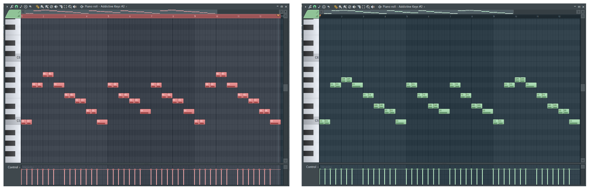

# Music Copilot

Music Copilot is an FL Studio piano roll script that uses OpenAI's GPT to help you edit and create notes using natural language. It's like having a [copilot](https://github.com/features/copilot) for your music production!

> Changing twinkle twinkle little star into minor key:


## Installation

Note that Python installation is needed on your system, since network access from piano roll script is currently disabled by FL Studio; so the script works by communicating with a sub-command that calls OpenAI's API.

1. As of April 2024, only [FL Studio 21.3 BETA](https://forum.image-line.com/viewtopic.php?p=1933611#p1933611) supports this script. Make sure to download and install this version.
2. Install Python and make sure it's added to your `PATH`. For Windows users:
   1. Go to https://www.python.org/downloads/ and download the latest version of Python.
   2. Run the installer, make sure to select **Add Python to PATH**.
3. Install the `openai` package by running the following command in your terminal / command prompt (you may need to run it as an administrator by searching for `cmd` in the Start menu, right-clicking it, and selecting `Run as administrator`):
   ```bash
   pip install openai
   ```
4. Download `music-copilot` by clicking `Code` -> `Download ZIP`.
5. Extract and move the entire `music-copilot` folder itself into `...Documents\Image-Line\FL Studio\Settings\Piano roll scripts`.
6. Sign up for OpenAI's API at https://platform.openai.com/signup.
7. Once you have an OpenAI API key, paste the key into `music-copilot/openai_api_key.txt`.

## Usage

- In piano roll, click on the wrench icon and select `Music Copilot`.
  - **Disable the preview feature**, otherwise the script may call GPT too many times.
  - Write a prompt in the text box and press `Regenerate` (to view the result before accepting) or `Accept`.
  - You can prompt the model to generate notes.
  - You can select notes and prompt the model to edit them. (Note: As of April 2024, the model cannot see non-selected notes if some notes are selected.)
- Once the script has been ran, you can access it again more quickly by pressing `Ctrl + Alt + Y`.

## Capabilities and Limitations

This script is a proof of concept and is far from perfect. Some of the things it can do include:
- Basic key / chord manipulation for very simple melodies
- Humanize notes
- Copying notes with some modifications
- "Logical" note operations (e.g. lengthen, shorten, chop, transpose)

Some of the things it does not do well include:
- Complex chord progressions
- Making arpeggios from existing notes
- Generating counter melodies or completions that sound good
- Generating good music from scratch

## Future Work

- GPT is very general and powerful, but it's not trained specifically for music. A custom model trained to model music data would be able to generate melodically and harmonically better music, similar to [MuseNet](https://openai.com/research/musenet).
- FL Studio piano roll scripts are limited in what they can do. In the ideal world, DAWs should embrace AI workflow and allow models to access data across channels, tracks, patterns, and so on, to be able to generate with respect to the entire song.